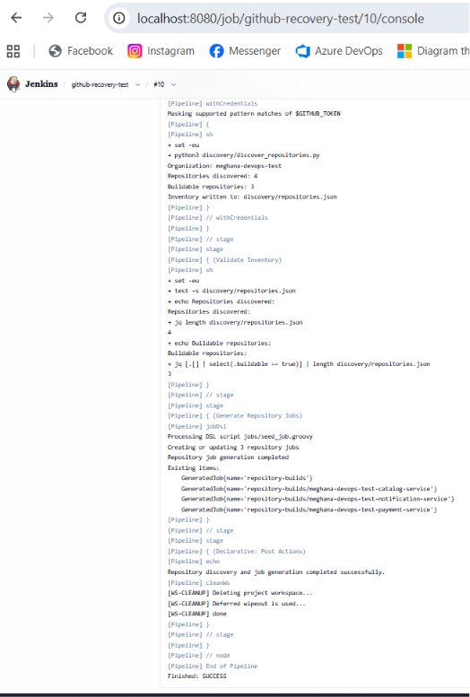
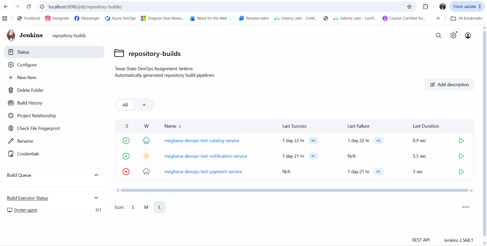
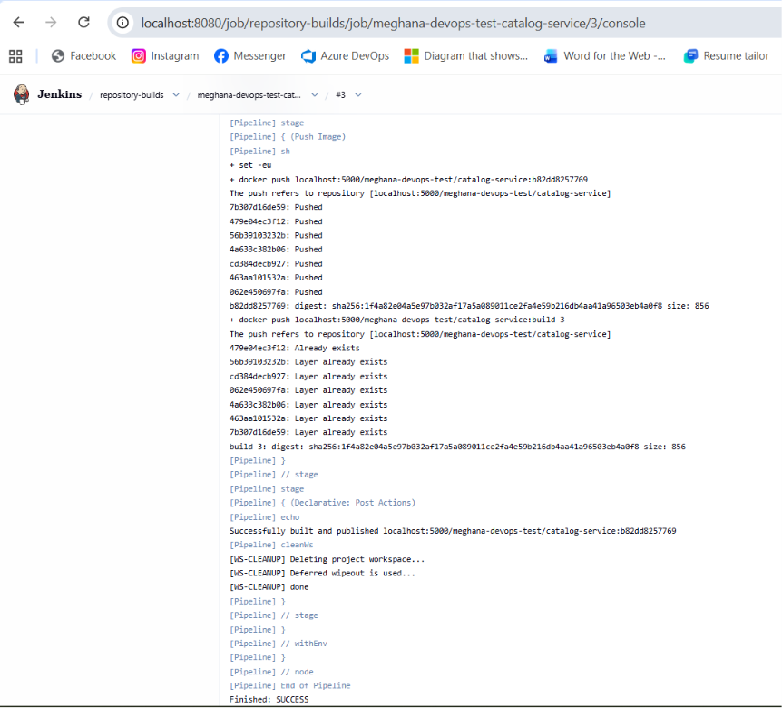
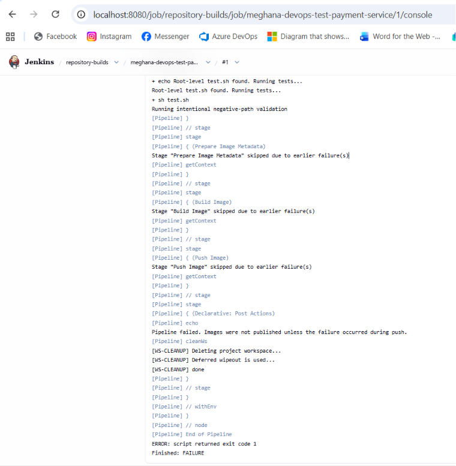

# GitHub Organization Jenkins Pipeline Factory

A Docker Compose-based Jenkins automation stack that discovers repositories in a GitHub organization, creates one Jenkins pipeline for each repository containing a root-level `Dockerfile`, runs an optional root-level `test.sh`, and publishes successful container images to a local Docker registry.

## Overview

The workflow performs the following:

1. Enumerates repositories in a GitHub organization.
2. Detects root-level `Dockerfile` and `test.sh` files.
3. Writes repository metadata to a JSON inventory.
4. Uses Jenkins Job DSL to create or update one pipeline per qualifying repository.
5. Runs `test.sh` when present.
6. Stops the pipeline when the test exits with a nonzero code.
7. Builds and tags successful Docker images.
8. Pushes the images to a local Docker Registry v2 instance.

## Architecture

```text
GitHub Organization
        |
        v
Jenkins Seed Pipeline
        |
        v
Repository Discovery
        |
        v
discovery/repositories.json
        |
        v
Jenkins Job DSL
        |
        v
Generated Repository Pipelines
        |
        v
Test Gate -> Docker Build -> Local Registry
```

### Components

| Component | Responsibility |
|---|---|
| Jenkins controller | Orchestrates repository discovery and generated jobs |
| Jenkins build agent | Runs Git, tests, Docker builds, and registry pushes |
| Discovery script | Enumerates and classifies GitHub repositories |
| Seed pipeline | Runs discovery and invokes Job DSL |
| Job DSL | Creates or updates repository-specific pipelines |
| Repository pipeline | Applies the reusable test, build, and push workflow |
| Local registry | Stores successfully published Docker images |
| Docker Compose | Runs the Jenkins controller, agent, and registry |

The Jenkins controller has zero executors. Repository workloads run only on the dedicated agent labeled `docker`.

## Repository Structure

```text
.
├── docker-compose.yml
├── .env.example
├── .gitignore
├── README.md
├── jenkins-controller/
│   ├── Dockerfile
│   ├── plugins.txt
│   └── casc.yaml
├── jenkins-agent/
│   └── Dockerfile
├── discovery/
│   ├── discover_repositories.py
│   ├── requirements.txt
│   └── tests/
│       └── test_discovery.py
├── jobs/
│   └── seed_job.groovy
├── pipelines/
│   ├── seed.Jenkinsfile
│   └── repository-build.Jenkinsfile
├── scripts/
│   ├── bootstrap.sh
│   └── verify.sh
└── docs/
    ├── architecture.md
    ├── security.md
    ├── ai-usage.md
    └── images/
        ├── seed-pipeline-success.png
        ├── generated-repository-jobs.png
        ├── catalog-service-success.png
        └── payment-service-test-gate.png
```

## Prerequisites

The host must have:

- Linux
- Git
- Docker Engine
- Docker Compose v2
- `curl`
- `jq`
- Internet access to GitHub and Docker Hub
- A GitHub token with read access to the target organization

Verify the required tools:

```bash
git --version
docker --version
docker compose version
curl --version
jq --version
```

Recommended minimum resources:

```text
CPU: 2 cores
Memory: 4 GB
Disk: 10 GB
```

## Clean Checkout Setup

### 1. Clone the repository

```bash
git clone https://github.com/meghanareddy08/Txstate-DevOps-Assignment.git
cd Txstate-DevOps-Assignment
```

### 2. Create the environment file

```bash
cp .env.example .env
```

Populate the values used by `docker-compose.yml`:

```env
JENKINS_ADMIN_USER=admin
JENKINS_ADMIN_PASSWORD=replace-with-a-secure-password

JENKINS_AGENT_NAME=Docker-agent
JENKINS_AGENT_SECRET=replace-with-the-generated-agent-secret

JENKINS_URL=http://jenkins-controller:8080
```

The `.env` file is excluded from Git and must not be committed.

Verify that it is not tracked:

```bash
git ls-files .env
```

Expected output: none.

### 3. Start the Jenkins controller and registry

For a clean Jenkins installation, start the controller and registry first:

```bash
docker compose up -d --build jenkins-controller registry
```

Monitor Jenkins startup:

```bash
docker compose logs -f jenkins-controller
```

Continue when the logs show:

```text
Jenkins is fully up and running
```

Open Jenkins locally:

```text
http://localhost:8080
```

For a remote host such as EC2, create an SSH tunnel from the local computer:

```bash
ssh -i /path/to/key.pem \
  -L 8080:localhost:8080 \
  user@REMOTE_HOST
```

Then open:

```text
http://localhost:8080
```

## One-Time Jenkins Configuration

These steps are required once on a clean Jenkins installation.

### 1. Create the Jenkins build agent

Navigate to:

```text
Manage Jenkins
-> Nodes
-> New Node
```

Configure:

```text
Node name: Docker-agent
Type: Permanent Agent
Number of executors: 1
Remote root directory: /home/jenkins/agent
Label: docker
Usage: Only build jobs matching this label
Launch method: Launch agent by connecting it to the controller
```

Save the node and copy the generated inbound-agent secret.

Add the secret to `.env`:

```env
JENKINS_AGENT_SECRET=generated-agent-secret
```

Start the complete environment:

```bash
./scripts/bootstrap.sh
```

Verify the agent connection:

```bash
docker compose logs --tail=30 jenkins-agent
```

Expected output includes:

```text
Connected
```

### 2. Create a read-only GitHub token

Create a GitHub token with read access to the organization being evaluated.

Recommended permissions:

```text
Repository access:
Selected repositories or all repositories in the target organization

Repository permissions:
Contents: Read-only
Metadata: Read-only
```

The token does not require repository write access.

### 3. Add the GitHub token to Jenkins

Navigate to:

```text
Manage Jenkins
-> Credentials
-> System
-> Global credentials
-> Add Credentials
```

Configure:

```text
Kind: Secret text
Secret: <GitHub read token>
ID: github-read-token
Description: Read-only GitHub organization discovery token
```

The credential ID must be exactly:

```text
github-read-token
```

The seed pipeline injects the token only during discovery. Jenkins masks the token in console output.

### 4. Create the seed pipeline job

From the Jenkins dashboard, select:

```text
New Item
```

Create:

```text
Name: github-organization-seed
Type: Pipeline
```

Configure the Pipeline section:

```text
Definition: Pipeline script from SCM
SCM: Git

Repository URL:
https://github.com/meghanareddy08/Txstate-DevOps-Assignment.git

Branch Specifier:
*/main

Script Path:
pipelines/seed.Jenkinsfile
```

Enable:

```text
Lightweight checkout
```

Save the job.

### 5. Approve the Job DSL script

On the first seed-pipeline run, Jenkins may report:

```text
script not yet approved for use
```

Navigate to:

```text
Manage Jenkins
-> In-process Script Approval
```

Approve the pending Job DSL script.

## Run the Workflow End to End

### 1. Run organization discovery

Open:

```text
github-organization-seed
-> Build with Parameters
```

Set the organization at runtime:

```text
GITHUB_ORG=meghana-devops-test
```

The seed pipeline runs:

```text
Checkout Assignment
-> Discover Repositories
-> Validate Inventory
-> Generate Repository Jobs
```

Expected demonstration result:

```text
Repositories discovered: 4
Buildable repositories: 3
Finished: SUCCESS
```

### 2. Review generated pipelines

The seed job creates the folder:

```text
repository-builds
```

Expected generated jobs:

```text
repository-builds/
├── meghana-devops-test-catalog-service
├── meghana-devops-test-notification-service
└── meghana-devops-test-payment-service
```

The seed job is idempotent. Re-running it updates existing managed jobs rather than creating duplicates.

### 3. Run the generated jobs

Expected outcomes:

| Repository | Dockerfile | test.sh | Expected outcome |
|---|---:|---:|---|
| `catalog-service` | Yes | Passes | Build and push |
| `notification-service` | Yes | Missing | Build and push |
| `payment-service` | Yes | Fails | Build and push skipped |
| `platform-documentation` | No | No | No pipeline created |

## Repository Qualification Rules

A repository receives a generated pipeline when:

```text
A root-level Dockerfile exists
AND
The repository is not archived
```

The root-level `test.sh` file is optional.

| Dockerfile | test.sh | Test exit code | Pipeline behavior |
|---|---|---:|---|
| Present | Present | `0` | Build and push |
| Present | Present | Nonzero | Stop before build |
| Present | Absent | Not applicable | Build and push |
| Absent | Any | Not applicable | No pipeline created |

The repository pipeline checks the files again after checkout so it does not rely only on the earlier discovery result.

## Image Naming and Tagging

Successful images are pushed to:

```text
localhost:5000/<organization>/<repository>:<tag>
```

Each successful build creates two tags:

```text
Git commit SHA
Jenkins build number
```

Example:

```text
localhost:5000/meghana-devops-test/catalog-service:b82dd8257769
localhost:5000/meghana-devops-test/catalog-service:build-3
```

The Git SHA provides source-code traceability.

The Jenkins build-number tag connects the image to a specific pipeline execution.

A mutable `latest` tag is intentionally not used.

## Verification

Run:

```bash
./scripts/verify.sh
```

The verification script checks:

- Docker Compose service status
- Jenkins availability
- local registry availability
- current registry catalog

List registry repositories manually:

```bash
curl -s http://localhost:5000/v2/_catalog | jq
```

Expected result after running the demonstration pipelines:

```json
{
  "repositories": [
    "meghana-devops-test/catalog-service",
    "meghana-devops-test/notification-service"
  ]
}
```

Only two image repositories are expected because:

- `catalog-service` passed and was pushed
- `notification-service` had no test and was pushed
- `payment-service` failed its test and was not pushed
- `platform-documentation` had no Dockerfile

List image tags:

```bash
curl -s \
  http://localhost:5000/v2/meghana-devops-test/catalog-service/tags/list \
  | jq
```

## Demonstrated Results

The test organization validates discovery, automated job creation, successful image publication, optional test handling, and failed-test enforcement.

### Seed Pipeline Success

The seed pipeline scanned `meghana-devops-test`, discovered four repositories, identified three buildable repositories, and created or updated the corresponding Jenkins jobs.



### Generated Repository Jobs

Job DSL created and manages one Jenkins pipeline for every qualifying repository.

The catalog and notification pipelines completed successfully. The payment pipeline failed intentionally because its test returned exit code `1`.



### Successful Build and Registry Push

The catalog service passed its test, built the image, created Git SHA and Jenkins build-number tags, and pushed both tags to `localhost:5000`.



### Failed Test Gate

The payment service intentionally returned exit code `1`.

Jenkins correctly skipped image metadata preparation, Docker build, and registry push.



## Failure Handling

### Discovery failure

When GitHub authentication, API access, or organization lookup fails:

- discovery exits nonzero
- Job DSL does not run
- existing generated jobs remain available
- the previous valid inventory is not replaced with incomplete data

### Missing Dockerfile after discovery

When a Dockerfile is removed between discovery and pipeline execution:

- repository validation fails
- Docker build does not run
- registry push does not run

### Failed test script

When `test.sh` returns a nonzero exit code:

- image metadata preparation is skipped
- Docker build is skipped
- registry push is skipped
- Jenkins reports failure

### Registry failure

When the registry is unavailable:

- image push fails
- Jenkins reports failure
- the image is not reported as successfully published

## Security Decisions

### Jenkins controller isolation

The Jenkins controller has zero executors.

Repository code and Docker builds run only on the dedicated build agent.

### GitHub credential

The GitHub token is:

- read-only
- stored in Jenkins Credentials
- injected only during repository discovery
- masked in Jenkins logs
- never stored in Git

### Docker socket access

Only the Jenkins build agent mounts:

```text
/var/run/docker.sock
```

The Jenkins controller does not receive Docker socket access.

Mounting the host Docker socket gives the agent privileged control over the host Docker daemon. This is an explicit trade-off for a controlled local evaluation environment.

### Local registry

The registry is intended for local evaluation and does not currently use:

- TLS
- authentication
- repository authorization
- image retention policies

## Assumptions

- Repositories use a root-level file named exactly `Dockerfile`.
- Optional tests use a root-level file named exactly `test.sh`.
- `test.sh` is compatible with `/bin/sh`.
- Exit code `0` means success.
- Any nonzero exit code means failure.
- The GitHub default branch is the branch to build.
- The target organization is within normal GitHub API limits.
- Docker is available through the host Docker socket.
- The registry is reachable from the host Docker daemon at `localhost:5000`.
- The environment is intended for local or controlled evaluation.

## Trade-offs

### Host Docker socket

Chosen because it provides:

- simple local setup
- fast Docker builds
- shared image layer caching
- fewer runtime components

Trade-offs:

- the build agent has host-level Docker privileges
- builds are not strongly isolated

Production alternatives include:

- ephemeral Kubernetes agents
- rootless BuildKit
- Kaniko
- isolated virtual machines

### Permanent Jenkins agent

Chosen because it provides:

- simple local operation
- low resource usage
- straightforward troubleshooting

A production platform should use short-lived agents created per build.

### Local registry

Chosen because it provides:

- simple reproducibility
- no external registry dependency
- easy local inspection

A production registry should include:

- TLS
- authentication
- authorization
- durable storage
- image retention
- vulnerability scanning
- image signing

### Manual initial Jenkins configuration

A clean installation currently requires one-time setup for:

- agent registration
- GitHub credential creation
- seed-job creation
- Job DSL approval

These steps are documented explicitly rather than hidden.

## Production Improvements

With additional time, the following improvements would be implemented:

- fully automated Jenkins initialization
- automated agent registration
- automated seed-job creation
- secure external secret management
- ephemeral isolated build workers
- GitHub webhook triggers
- GitHub App authentication
- retry and exponential backoff
- explicit GitHub rate-limit handling
- registry TLS and authentication
- container vulnerability scanning
- software bill of materials generation
- image signing and provenance
- secret scanning
- structured JSON logging
- Prometheus metrics and dashboards
- image retention and garbage collection
- automated integration tests

## Restarting the Environment

After restarting the same host:

```bash
cd Txstate-DevOps-Assignment
./scripts/bootstrap.sh
./scripts/verify.sh
```

Jenkins configuration, jobs, credentials, build history, and registry images persist through Docker volumes.

Do not run:

```bash
docker compose down -v
```

unless persistent Jenkins and registry data should be permanently deleted.

## AI-Assisted Development Disclosure

Generative AI was used to assist with:

- evaluating architecture options
- drafting initial configuration
- troubleshooting Jenkins and Docker errors
- improving documentation structure
- reviewing security trade-offs

All suggestions were reviewed and tested against the running environment.

Corrections made during implementation included:

- using `localhost:5000` for registry pushes
- removing an unsupported Jenkins pipeline option
- renaming the Job DSL script for Jenkins compatibility
- creating the parent Jenkins folder before nested jobs
- fixing Jenkins readiness checks
- testing passing, missing-test, and failing-test scenarios separately

The final implementation reflects tested runtime behavior.

## Final Demonstrated Results

```text
GitHub repositories discovered:       4
Generated Jenkins pipelines:          3
Successful images published:          2
Expected failed test pipelines:       1
Repositories filtered without image:  1
```

```text
catalog-service
test passed -> image built -> image pushed -> SUCCESS

notification-service
no test.sh -> image built -> image pushed -> SUCCESS

payment-service
test failed -> build skipped -> push skipped -> EXPECTED FAILURE

platform-documentation
no Dockerfile -> no generated pipeline
```

## Stop the Environment

Stop containers while preserving persistent data:

```bash
docker compose down
```

Remove containers and persistent Jenkins and registry data:

```bash
docker compose down -v
```

Warning: `docker compose down -v` permanently removes Jenkins jobs, credentials, build history, and registry images.
