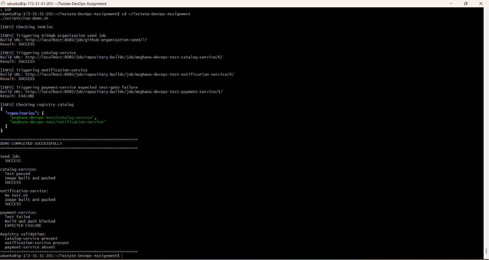

# GitHub Organization Jenkins Pipeline Factory

This project runs Jenkins and a local Docker Registry in Docker Compose.

Given a GitHub organization, it:

1. discovers all repositories
2. checks each repository for a root-level `Dockerfile`
3. creates or updates one Jenkins pipeline per qualifying repository
4. runs a root-level `test.sh` when present
5. stops the pipeline when the test fails
6. builds and pushes successful images to the local registry

The Jenkins controller has zero executors. Discovery, testing, Docker builds, and registry pushes run on a dedicated Jenkins agent labeled `docker`.

---

## Demonstrated Results

The workflow was tested against:

```text
meghana-devops-test
```

| Repository | Dockerfile | test.sh | Result |
|---|---:|---:|---|
| `catalog-service` | Yes | Passes | Image built and pushed |
| `notification-service` | Yes | Missing | Image built and pushed |
| `payment-service` | Yes | Fails | Build and push blocked |
| `platform-documentation` | No | N/A | No Jenkins job created |

Final result:

```text
Repositories discovered: 4
Generated Jenkins jobs: 3
Successful images published: 2
Expected failed pipelines: 1
```

---

## Architecture

```text
GitHub Organization
        |
        v
Jenkins Seed Pipeline
        |
        v
Repository Discovery
        |
        v
Jenkins Job DSL
        |
        v
Generated Repository Pipelines
        |
        v
Optional test.sh
        |
        v
Docker Build
        |
        v
Local Docker Registry
```

Main components:

| Component | Purpose |
|---|---|
| Jenkins controller | Orchestrates seed and generated jobs |
| Jenkins agent | Runs discovery, tests, builds, and pushes |
| Discovery script | Enumerates repositories and checks files |
| Job DSL | Creates repository-specific Jenkins jobs |
| Repository pipeline | Applies test, build, and push logic |
| Local registry | Stores successful Docker images |
| `bootstrap.sh` | Starts and validates the environment |
| `run-demo.sh` | Runs the complete demonstration |
| `verify.sh` | Checks Jenkins, Compose, and registry status |

---

## Prerequisites

The host must have:

- Linux
- Git
- Docker Engine
- Docker Compose v2
- `curl`
- `jq`
- internet access to GitHub and Docker Hub
- a GitHub token with read access to the target repositories

Verify:

```bash
git --version
docker --version
docker compose version
curl --version
jq --version
```

Recommended minimum resources:

```text
CPU: 2 cores
Memory: 4 GB
Disk: 10 GB
```

---

## Clean Checkout Setup

### 1. Clone the repository

```bash
git clone https://github.com/meghanareddy08/Txstate-DevOps-Assignment.git
cd Txstate-DevOps-Assignment
```

### 2. Create the environment file

```bash
cp .env.example .env
```

Update `.env`:

```env
JENKINS_ADMIN_USER=admin
JENKINS_ADMIN_PASSWORD=replace-with-a-secure-password

JENKINS_AGENT_NAME=Docker-agent
JENKINS_AGENT_SECRET=replace-with-the-generated-agent-secret

JENKINS_URL=http://jenkins-controller:8080
```

The `.env` file is ignored by Git and must not be committed.

Verify:

```bash
git check-ignore .env
git ls-files .env
```

The first command should print `.env`. The second should print nothing.

### 3. Start Jenkins and the registry

Run:

```bash
./scripts/bootstrap.sh
```

On the first run, the script:

- validates prerequisites
- starts the Jenkins controller
- starts the local registry
- waits for Jenkins readiness
- prints the remaining agent-registration steps

Check services:

```bash
docker compose ps
```

Monitor Jenkins:

```bash
docker compose logs -f jenkins-controller
```

Continue when the logs show:

```text
Jenkins is fully up and running
```

Direct Compose startup is also available:

```bash
docker compose up -d --build jenkins-controller registry
```

### 4. Open Jenkins

For local use:

```text
http://localhost:8080
```

For EC2, create an SSH tunnel from the local computer:

```bash
ssh -i /path/to/key.pem \
  -L 8080:localhost:8080 \
  ubuntu@EC2_PUBLIC_IP
```

Then open:

```text
http://localhost:8080
```

Log in using the admin credentials from `.env`.

---

## One-Time Jenkins Setup

### 1. Confirm the seed job

Jenkins Configuration as Code automatically creates:

```text
github-organization-seed
```

It uses:

```text
Repository:
https://github.com/meghanareddy08/Txstate-DevOps-Assignment.git

Branch:
*/main

Script path:
pipelines/seed.Jenkinsfile
```

The seed job does not need to be created manually.

### 2. Create the build agent

In Jenkins:

```text
Manage Jenkins
-> Nodes
-> New Node
```

Configure:

```text
Node name: Docker-agent
Type: Permanent Agent
Executors: 1
Remote root directory: /home/jenkins/agent
Label: docker
Usage: Only build jobs matching this label
Launch method: Launch agent by connecting it to the controller
```

Save the node and copy the generated agent secret.

Update `.env`:

```env
JENKINS_AGENT_SECRET=generated-agent-secret
```

Run:

```bash
./scripts/bootstrap.sh
```

Verify:

```bash
docker compose logs --tail=50 jenkins-agent
```

Expected output includes:

```text
Connected
```

### 3. Add the GitHub token

Create a fine-grained GitHub token with read-only access.

Recommended permissions:

```text
Contents: Read-only
Metadata: Read-only
```

In Jenkins:

```text
Manage Jenkins
-> Credentials
-> System
-> Global credentials
-> Add Credentials
```

Configure:

```text
Kind: Secret text
Secret: <GitHub read token>
ID: github-read-token
Description: Read-only GitHub discovery token
```

The credential ID must be exactly:

```text
github-read-token
```

### 4. Approve Job DSL if requested

If Jenkins reports:

```text
script not yet approved for use
```

go to:

```text
Manage Jenkins
-> In-process Script Approval
```

Approve the pending script.

---

## Run the Workflow End to End

After Jenkins is running, the agent is connected, and the GitHub credential exists, run:

```bash
./scripts/run-demo.sh
```

The script:

1. triggers the seed pipeline
2. supplies `meghana-devops-test` as the organization
3. waits for repository jobs to be generated
4. runs catalog, notification, and payment pipelines
5. checks expected success and failure results
6. validates registry contents

Expected final output:

```text
============================================================
DEMO COMPLETED SUCCESSFULLY
============================================================

Seed job:
  SUCCESS

catalog-service:
  Test passed
  Image built and pushed
  SUCCESS

notification-service:
  No test.sh
  Image built and pushed
  SUCCESS

payment-service:
  Test failed
  Build and push blocked
  EXPECTED FAILURE

Registry validation:
  catalog-service present
  notification-service present
  payment-service absent
```

The `payment-service` Jenkins job is intentionally expected to finish with `FAILURE`. This confirms that a failed test prevents both the Docker build and registry push.

---

## Run Against Another GitHub Organization

Open:

```text
github-organization-seed
-> Build with Parameters
```

Set:

```text
GITHUB_ORG=<organization-name>
```

The seed pipeline will:

- enumerate repositories
- detect root-level `Dockerfile` and `test.sh`
- create or update Jenkins jobs for qualifying repositories

A repository qualifies when:

```text
A root-level Dockerfile exists
AND
The repository is not archived
```

The root-level `test.sh` file is optional.

| Dockerfile | test.sh | Pipeline behavior |
|---|---|---|
| Present | Passes | Build and push |
| Present | Fails | Stop before build |
| Present | Missing | Build and push |
| Missing | Any | No Jenkins job |
| Present | Any | No job when archived |

---

## Image Naming

Successful images are pushed to:

```text
localhost:5000/<organization>/<repository>:<tag>
```

Each successful build creates:

- a Git commit SHA tag
- a Jenkins build-number tag

Example:

```text
localhost:5000/meghana-devops-test/catalog-service:b82dd8257769
localhost:5000/meghana-devops-test/catalog-service:build-3
```

A mutable `latest` tag is intentionally not used.

---

## Verification

Run:

```bash
./scripts/verify.sh
```

Check the registry:

```bash
curl -s http://localhost:5000/v2/_catalog | jq
```

Expected:

```json
{
  "repositories": [
    "meghana-devops-test/catalog-service",
    "meghana-devops-test/notification-service"
  ]
}
```

The payment image must be absent because its test failed.

---

## Failure Handling

The implementation handles:

- invalid or expired GitHub credentials
- unknown or inaccessible organizations
- temporary GitHub API errors
- missing Dockerfiles after discovery
- failed test scripts
- unavailable registry
- offline Jenkins agents

Temporary GitHub errors such as `429`, `500`, `502`, `503`, and `504` are retried with exponential backoff.

If discovery fails:

- Job DSL does not run
- existing generated jobs remain available
- incomplete inventory data is not saved

If `test.sh` fails:

- Docker build is skipped
- registry push is skipped
- Jenkins reports failure

---

## Security Decisions

- The Jenkins controller has zero executors.
- Repository workloads run only on the dedicated build agent.
- The GitHub token is read-only.
- The token is stored in Jenkins Credentials.
- The token is injected only during discovery.
- Jenkins masks the token in console logs.
- `.env` is ignored by Git.
- Only the Jenkins agent mounts `/var/run/docker.sock`.
- The registry is intended for local evaluation and should not be exposed publicly.

The Docker socket gives the build agent control over the host Docker daemon. This is an explicit trade-off for a controlled local evaluation environment.

---

## Assumptions

- repositories use a root-level `Dockerfile`
- optional tests use a root-level `test.sh`
- `test.sh` is compatible with `/bin/sh`
- exit code `0` means success
- any nonzero exit code means failure
- the GitHub default branch is built
- repositories are cloned through HTTPS
- Docker is available through the host Docker socket
- the registry is reachable at `localhost:5000`
- the environment is local or otherwise controlled

---

## Trade-offs

### Host Docker socket

Chosen for simple setup and fast Docker builds.

Trade-off: the agent has host-level Docker privileges.

Production alternatives include:

- rootless BuildKit
- Kaniko
- ephemeral Kubernetes agents
- isolated virtual machines

### Permanent Jenkins agent

Chosen for simple local operation and troubleshooting.

A production system should use short-lived isolated agents.

### Local registry

Chosen for reproducibility and easy inspection.

A production registry should include TLS, authentication, retention policies, vulnerability scanning, and image signing.

### Jenkins Job DSL

Chosen for readable, repeatable, and idempotent job generation.

The first run may require script approval.

---

## Improvements With More Time

- automate inbound-agent registration
- use external secret management
- use GitHub App authentication
- add GitHub webhook triggers
- use ephemeral build agents
- add registry TLS and authentication
- add image vulnerability scanning
- generate software bills of materials
- add image signing and provenance
- remove obsolete generated jobs automatically
- support configurable Dockerfile and test paths

---

## Evidence

### Automated End-to-End Demo



### Seed Pipeline Success


### Generated Repository Jobs


### Catalog Service Success


### Payment Service Test Gate


---

## Restarting

After restarting the same host:

```bash
cd Txstate-DevOps-Assignment
./scripts/bootstrap.sh
./scripts/verify.sh
```

Jenkins jobs, credentials, build history, and registry images persist through Docker volumes.

---

## Stopping

Stop containers while preserving data:

```bash
docker compose down
```

Remove containers and all persistent data:

```bash
docker compose down -v
```

> **Warning:** `docker compose down -v` permanently removes Jenkins jobs, credentials, build history, and registry images.

---

## AI-Assisted Development

Generative AI was used for architecture review, configuration drafting, troubleshooting, documentation organization, and security review.

All suggestions were reviewed, corrected where necessary, and tested against the running environment.
