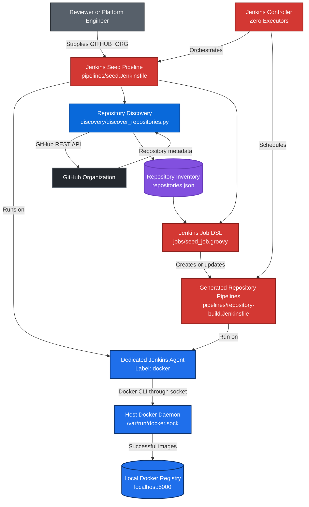
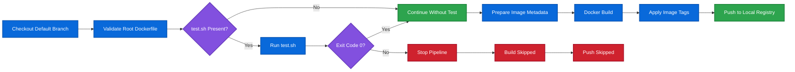
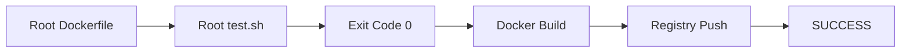
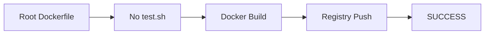
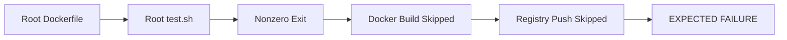
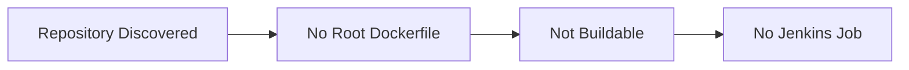
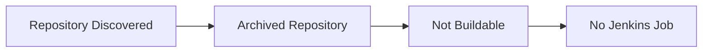
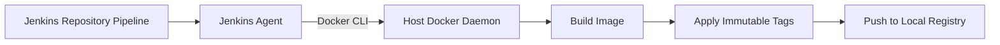
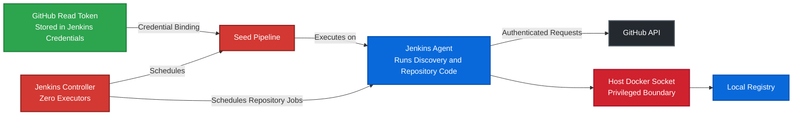

# Architecture

This document describes the technical flow, execution model, and component boundaries of the GitHub Organization Jenkins Pipeline Factory.

For installation and reviewer instructions, see the main [README](../README.md).

## System Overview

The local Docker Compose stack contains:

- a Jenkins controller;
- a dedicated Jenkins build agent;
- a local Docker Registry.

The Jenkins controller has zero executors. It handles configuration, credentials, scheduling, job creation, and build history.

The dedicated Jenkins agent executes:

- GitHub organization discovery;
- repository checkout;
- optional test execution;
- Docker image builds;
- registry pushes.

Only the Jenkins agent mounts the host Docker socket:

```text
/var/run/docker.sock
```

GitHub remains the external source-control and repository-discovery service. Jenkins, its build agent, and the container registry run locally through Docker Compose.

## System Architecture



## Component Responsibilities

| Component | Responsibility |
|---|---|
| Jenkins controller | Stores configuration and credentials, creates jobs, schedules builds, and retains build history |
| Jenkins agent | Executes discovery, repository pipelines, tests, Docker builds, and registry pushes |
| Discovery script | Enumerates repositories and inspects root-level files |
| Repository inventory | Transfers normalized discovery results to Job DSL |
| Job DSL | Creates or updates one Jenkins pipeline per qualifying repository |
| Repository pipeline | Performs checkout, validation, optional testing, image building, and publication |
| Host Docker daemon | Builds and tags images requested by the Jenkins agent |
| Local registry | Stores images produced by successful pipelines |

## Jenkins Execution Model

The controller does not:

- execute repository code;
- run tests;
- perform Docker builds;
- mount the Docker socket.

The dedicated agent performs:

```text
GitHub discovery
Repository checkout
Test execution
Docker image build
Registry push
```

Both the seed pipeline and generated repository pipelines use the Jenkins label:

```text
docker
```

This separates repository execution from the Jenkins controller.

## Discovery and Job Generation

```mermaid
flowchart LR
    A[Seed Pipeline Starts] --> B[Run Discovery Script]
    B --> C[Call GitHub REST API]
    C --> D[Enumerate Organization Repositories]
    D --> E[Inspect Root-Level Files]
    E --> F{Repository Archived?}

    F -->|Yes| G[Mark Not Buildable]
    F -->|No| H{Dockerfile Present?}

    H -->|No| G
    H -->|Yes| I[Mark Buildable]

    I --> J[Record Optional test.sh]
    G --> K[Write Inventory Entry]
    J --> K

    K --> L[Atomically Write repositories.json]
    L --> M[Run Job DSL]
    M --> N[Create or Update Pipeline Job]

    classDef success fill:#2da44e,color:#ffffff,stroke:#1a7f37,stroke-width:2px;
    classDef filtered fill:#6e7781,color:#ffffff,stroke:#424a53,stroke-width:2px;
    classDef process fill:#0969da,color:#ffffff,stroke:#0550ae,stroke-width:2px;
    classDef decision fill:#8250df,color:#ffffff,stroke:#6639ba,stroke-width:2px;

    class A,B,C,D,E,J,K,L,M,N process;
    class I success;
    class G filtered;
    class F,H decision;
```



A repository is buildable when:

```text
A root-level Dockerfile exists
AND
The repository is not archived
```

A root-level `test.sh` is optional. Its presence determines whether the generated pipeline runs the test gate.

## Discovery Inventory

The inventory records:

```text
Repository name
Full repository name
Clone URL
Default branch
Archived state
Dockerfile presence
test.sh presence
Buildable state
```

The inventory is written atomically.

A temporary file is written first and promoted only after discovery succeeds. This prevents a failed or interrupted discovery run from replacing valid data with a partial result.

The inventory is an intermediate file created in the Jenkins workspace. It does not need to exist permanently in the source repository.

## Job Generation

The seed pipeline passes the inventory to:

```text
jobs/seed_job.groovy
```

Job DSL creates or updates one pipeline for every repository marked as buildable.

Generated jobs are placed under:

```text
repository-builds
```

Each generated job receives repository-specific values such as:

```text
Repository name
Full repository name
Clone URL
Default branch
```

Each job loads the shared pipeline definition from:

```text
pipelines/repository-build.Jenkinsfile
```

Using a shared Jenkinsfile keeps generated pipelines consistent and maintainable.

Repositories without a root-level `Dockerfile` do not receive a Jenkins job.

## Repository Pipeline



The pipeline validates the root-level `Dockerfile` again after checkout. This protects against a repository changing between discovery and execution.

## Test-Gate Outcomes

### Passing Test



### Missing Test Script



### Failing Test



### Missing Dockerfile



### Archived Repository



Archived repositories are excluded even if they contain a root-level `Dockerfile`.

## Image Publication

The Jenkins agent runs the Docker client and communicates with the host Docker daemon through the mounted Docker socket.



Successful images are pushed to:

```text
localhost:5000/<organization>/<repository>:<tag>
```

Each successful build produces:

```text
Git commit SHA tag
Jenkins build-number tag
```

Example:

```text
localhost:5000/meghana-devops-test/catalog-service:b82dd8257769
localhost:5000/meghana-devops-test/catalog-service:build-3
```

A mutable `latest` tag is intentionally not used.

This provides traceability between:

- the source commit;
- the Jenkins build;
- the published image.

Only pipelines that pass the test gate publish images.

## Networking

Docker Compose provides internal networking between the Jenkins controller, Jenkins agent, and registry.

The controller is reachable from the agent through:

```text
http://jenkins-controller:8080
```

Jenkins is exposed on the host as:

```text
localhost:8080
```

The registry is exposed on the host as:

```text
localhost:5000
```

On a remote Linux host such as EC2, Jenkins can be accessed through an SSH tunnel without publicly exposing port `8080`.

The registry is intended for local evaluation and should not be exposed publicly.

## Persistence

Docker volumes preserve:

- Jenkins configuration;
- Jenkins credentials;
- generated jobs;
- plugin data;
- build history;
- registry images.

Running:

```bash
docker compose down
```

removes containers while preserving persistent data.

Running:

```bash
docker compose down -v
```

removes containers and all project volumes, including Jenkins configuration and registry images.

A new Jenkins data volume requires the documented one-time bootstrap steps again.

## Security Boundaries



Security boundaries:

- The controller has zero executors.
- Repository code runs only on the dedicated Jenkins agent.
- The controller does not mount the Docker socket.
- Only the agent mounts `/var/run/docker.sock`.
- The GitHub token is read-only.
- The token is stored in Jenkins Credentials.
- The token is injected only during discovery.
- Jenkins masks the token in console output.
- The local registry does not provide production-grade TLS or authentication.
- Access to the Docker socket gives the agent substantial control over the host Docker daemon.

The Docker socket is therefore treated as a privileged security boundary.

## Automation Boundary

The repeated repository build workflow is automated.

After the documented one-time Jenkins bootstrap, the system automatically:

1. enumerates repositories in the selected GitHub organization;
2. identifies archived repositories;
3. detects root-level `Dockerfile` and `test.sh` files;
4. creates or updates Jenkins jobs for qualifying repositories;
5. checks out each repository's default branch;
6. executes `test.sh` when present;
7. uses the test exit code as a build gate;
8. builds eligible Docker images;
9. applies traceable image tags;
10. pushes successful images to the local registry.

A completely new Jenkins data volume requires these one-time bootstrap actions:

- registering the inbound Jenkins agent;
- supplying the Jenkins-generated agent secret;
- creating the read-only GitHub credential;
- approving the initial Job DSL script when Jenkins requires it.

These are environment and security initialization tasks rather than per-repository workflow steps.

## Failure Handling

### Discovery Failure

If repository discovery fails:

```text
Job DSL does not run
Incomplete inventory data is not promoted
Existing generated jobs remain available
The seed pipeline reports failure
```

Temporary GitHub API responses such as `429`, `500`, `502`, `503`, and `504` are retried with exponential backoff.

### Test Failure

If `test.sh` exits with a nonzero status:

```text
Docker build is skipped
Registry push is skipped
The Jenkins job reports failure
```

### Missing Dockerfile After Discovery

If the Dockerfile is removed between discovery and execution:

```text
The pipeline fails validation
No image is built
No image is pushed
```

### Registry Failure

If the local registry is unavailable:

```text
The image build may complete
The push stage fails
The Jenkins pipeline reports failure
```

### Offline Agent

If the dedicated agent is offline:

```text
The controller retains the queued build
No repository workload runs on the controller
Execution resumes when the docker-labeled agent becomes available
```

## Key Architecture Decisions

| Decision | Reason | Trade-off |
|---|---|---|
| Docker Compose | Provides a reproducible local Jenkins and registry environment | Depends on host Docker installation |
| Controller with zero executors | Prevents repository code from running on the controller | Requires a separate agent |
| Dedicated permanent agent | Simplifies local execution and troubleshooting | Less isolated than ephemeral agents |
| Job DSL | Creates one visible pipeline per qualifying repository | Initial script approval may be required |
| Shared repository Jenkinsfile | Keeps generated jobs consistent | Repository-specific variations require parameters |
| Python discovery script | Provides clear API handling, filtering, and retry logic | Adds Python as an agent dependency |
| Atomic JSON inventory | Prevents incomplete discovery results from replacing valid data | Adds an intermediate artifact |
| Host Docker socket | Enables simple and fast local image builds | Gives the agent privileged host Docker access |
| Local registry | Avoids dependency on an external image registry | Lacks production TLS, authentication, and retention controls |
| Git SHA and build-number tags | Provides source and Jenkins traceability | Creates multiple tags for each successful build |
| No mutable `latest` tag | Avoids ambiguity between image revisions | Consumers must select a specific tag |

## Production Alternatives

Possible production improvements include:

- ephemeral Kubernetes Jenkins agents;
- rootless BuildKit;
- Kaniko or another daemonless builder;
- isolated virtual-machine workers;
- GitHub App authentication;
- external secret management;
- registry authentication and TLS;
- image vulnerability scanning;
- software bills of materials;
- image signing and provenance;
- webhook-based pipeline triggering;
- automatic deletion of obsolete generated jobs.

## Demonstrated Behavior

| Repository | Root Dockerfile | Root `test.sh` | Expected result |
|---|---:|---:|---|
| `catalog-service` | Yes | Passes | Image built and pushed |
| `notification-service` | Yes | Missing | Image built and pushed |
| `payment-service` | Yes | Fails | Build and push blocked |
| `platform-documentation` | No | N/A | No Jenkins job generated |

Expected local registry contents:

```text
meghana-devops-test/catalog-service
meghana-devops-test/notification-service
```

The following image must be absent:

```text
meghana-devops-test/payment-service
```

This demonstrates:

- repository discovery;
- Dockerfile-based qualification;
- automatic Jenkins job generation;
- passing optional tests;
- missing optional tests;
- failed test gating;
- successful image publication;
- prevention of publication after a failed test.
  
