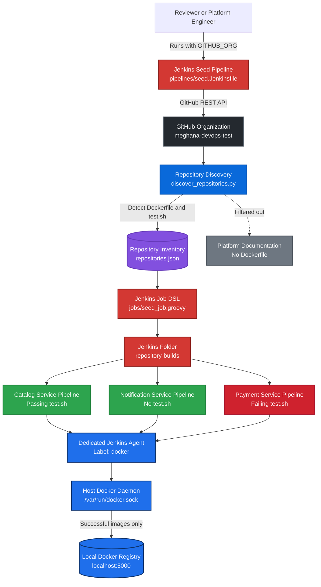
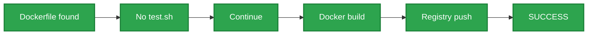

# Architecture

This document explains the end-to-end design of the GitHub Organization Jenkins Pipeline Factory.

## System Architecture



## Runtime Components

| Component | Responsibility |
|---|---|
| Jenkins controller | Loads configuration, runs the seed pipeline, and manages generated jobs |
| Jenkins agent | Executes repository checkout, testing, Docker builds, and registry pushes |
| Discovery script | Enumerates GitHub repositories and detects root-level build files |
| Repository inventory | Stores normalized discovery results in JSON |
| Job DSL | Creates or updates one Jenkins pipeline for each qualifying repository |
| Repository pipeline | Applies the reusable test, build, tag, and push workflow |
| Docker daemon | Builds container images through the mounted host Docker socket |
| Local registry | Stores successfully published container images |

## End-to-End Flow

### 1. Start the environment

Docker Compose starts:

```text
Jenkins controller
Jenkins build agent
Docker Registry v2
```

The controller orchestrates the environment but does not execute repository workloads.

The dedicated agent is labeled:

```text
docker
```

### 2. Run the seed pipeline

The reviewer runs the Jenkins seed job with:

```text
GITHUB_ORG=meghana-devops-test
```

The seed pipeline is loaded from:

```text
pipelines/seed.Jenkinsfile
```

### 3. Enumerate GitHub repositories

The discovery script calls the GitHub REST API and enumerates repositories in the selected organization.

For every repository, it determines:

```text
Repository name
Clone URL
Default branch
Archived state
Root-level Dockerfile presence
Root-level test.sh presence
Buildable state
```

### 4. Create the discovery inventory

Discovery results are written to:

```text
discovery/repositories.json
```

A repository is marked buildable when:

```text
Root-level Dockerfile exists
AND
Repository is not archived
```

The inventory is written atomically so a failed discovery run does not replace the last valid inventory with incomplete data.

### 5. Generate Jenkins jobs

The seed pipeline invokes:

```text
jobs/seed_job.groovy
```

Job DSL creates or updates the folder:

```text
repository-builds
```

It then creates one Jenkins pipeline for each buildable repository.

For the demonstration organization, the generated jobs are:

```text
meghana-devops-test-catalog-service
meghana-devops-test-notification-service
meghana-devops-test-payment-service
```

The documentation-only repository is filtered because it has no root-level Dockerfile.

### 6. Execute repository pipelines

Each generated job loads:

```text
pipelines/repository-build.Jenkinsfile
```

The pipeline performs:

```text
Checkout
-> Validate Dockerfile
-> Run optional test.sh
-> Prepare image metadata
-> Build image
-> Push image
```

### 7. Apply the test gate

The repository pipeline applies these rules:

| Dockerfile | test.sh | Exit code | Result |
|---|---|---:|---|
| Present | Present | `0` | Build and push |
| Present | Present | Nonzero | Stop before build |
| Present | Missing | Not applicable | Build and push |
| Missing | Any | Not applicable | No generated job |

### 8. Build container images

The Jenkins agent mounts:

```text
/var/run/docker.sock
```

Docker CLI commands inside the agent therefore communicate with the host Docker daemon.

The Jenkins controller does not receive Docker socket access.

### 9. Tag successful images

Each successful image receives two tags.

Git SHA:

```text
localhost:5000/<organization>/<repository>:<git-sha>
```

Jenkins build number:

```text
localhost:5000/<organization>/<repository>:build-<number>
```

Example:

```text
localhost:5000/meghana-devops-test/catalog-service:b82dd8257769
localhost:5000/meghana-devops-test/catalog-service:build-3
```

### 10. Push to the local registry

Successful images are pushed to:

```text
localhost:5000
```

The host Docker daemon uses the registry port published by Docker Compose.

Only successful builds are published.

Expected registry contents:

```text
meghana-devops-test/catalog-service
meghana-devops-test/notification-service
```

The payment image is absent because its test fails.

## Demonstrated Execution Paths

### Passing test


### No test script



### Failing test


### Repository without Dockerfile


## Security Boundaries

```mermaid
flowchart LR
    CONTROLLER[Jenkins Controller<br/>No executors]

    AGENT[Jenkins Agent<br/>Executes repository code]

    SOCKET[Host Docker Socket<br/>Privileged boundary]

    REGISTRY[Local Registry<br/>Evaluation only]

    TOKEN[GitHub Read Token<br/>Jenkins Credentials]

    TOKEN -->|Injected during discovery only| CONTROLLER
    CONTROLLER -->|Schedules jobs| AGENT
    AGENT --> SOCKET
    SOCKET --> REGISTRY

    classDef safe fill:#2da44e,color:#ffffff,stroke:#1a7f37,stroke-width:2px;
    classDef sensitive fill:#cf222e,color:#ffffff,stroke:#a40e26,stroke-width:2px;
    classDef service fill:#0969da,color:#ffffff,stroke:#0550ae,stroke-width:2px;

    class CONTROLLER,TOKEN safe;
    class AGENT,REGISTRY service;
    class SOCKET sensitive;
```



Key decisions:

- The Jenkins controller has zero executors.
- Repository code runs only on the dedicated agent.
- The GitHub token is read-only and stored in Jenkins Credentials.
- The token is injected only during repository discovery.
- The controller does not mount the Docker socket.
- Only the build agent can access the host Docker daemon.
- The local registry is not intended for public exposure.

## Current Trade-offs

### Docker socket

The host Docker socket provides:

- simple local setup
- faster builds
- shared layer caching
- fewer runtime services

It also gives the build agent privileged access to the host Docker daemon.

A production implementation should use isolated ephemeral builders.

### Permanent Jenkins agent

The permanent inbound agent provides a simple and understandable local design.

A production implementation should create short-lived workers for each build.

### Local registry

The local registry avoids reliance on an external container registry.

A production registry should provide:

- TLS
- authentication
- authorization
- retention policies
- vulnerability scanning
- image signing
- durable storage

### Manual bootstrap tasks

A clean Jenkins installation currently requires one-time configuration for:

- agent registration
- GitHub credential creation
- seed-job creation
- Job DSL approval

A production implementation should automate these tasks through Jenkins Configuration as Code and secure secret provisioning.

## Production Evolution

A production version would introduce:

```text
GitHub App authentication
Webhook-driven discovery
Ephemeral build workers
Rootless image builds
External secret management
Authenticated registry
TLS
Vulnerability scanning
SBOM generation
Image signing
Build provenance
Structured logging
Metrics and alerting
Retention and garbage collection
Automated integration tests
```

## Summary

```text
Repositories discovered: 4
Buildable repositories: 3
Generated Jenkins jobs: 3
Successful image publications: 2
Expected test-gated failures: 1
Repositories filtered without Dockerfile: 1
```
