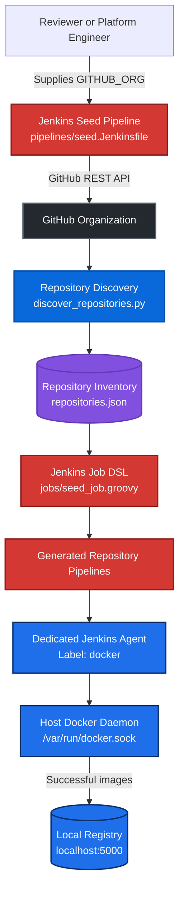
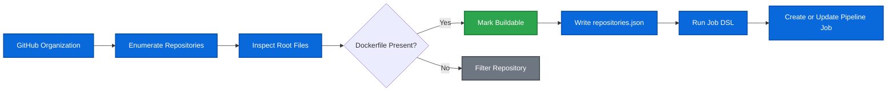
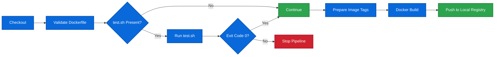

# Architecture

This document describes the technical flow and component boundaries of the GitHub Organization Jenkins Pipeline Factory.

For installation, configuration, and reviewer instructions, see the main [README](../README.md).

## System Architecture



## Component Interaction

The Jenkins controller orchestrates the workflow and has zero executors.

The dedicated Jenkins agent performs:

```text
Repository checkout
Test execution
Docker image build
Registry push
```

The controller does not mount the Docker socket.

Only the build agent receives:

```text
/var/run/docker.sock
```

## Discovery and Job Generation



A repository is buildable when:

```text
Root-level Dockerfile exists
AND
Repository is not archived
```

The discovery inventory records:

```text
Repository name
Full repository name
Clone URL
Default branch
Archived state
Dockerfile presence
test.sh presence
Buildable state
```

The inventory is written atomically so a failed discovery run does not replace the last valid result with partial data.

## Repository Pipeline

Each generated job loads:

```text
pipelines/repository-build.Jenkinsfile
```

The execution flow is:



## Test-Gate Outcomes

### Passing Test


### No Test Script


### Failing Test


### Missing Dockerfile


## Image Publication Flow

Successful images are built by the host Docker daemon and pushed to:

```text
localhost:5000/<organization>/<repository>:<tag>
```

Each successful build produces:

```text
Git commit SHA tag
Jenkins build-number tag
```

Only pipelines that pass the test gate publish images.

## Security Boundaries

```mermaid
flowchart LR
    TOKEN[GitHub Read Token]

    CONTROLLER[Jenkins Controller<br/>Zero Executors]

    AGENT[Jenkins Agent<br/>Runs Repository Code]

    SOCKET[Host Docker Socket<br/>Privileged Boundary]

    REGISTRY[Local Registry]

    TOKEN -->|Injected during discovery| CONTROLLER
    CONTROLLER -->|Schedules work| AGENT
    AGENT --> SOCKET
    SOCKET --> REGISTRY

    classDef safe fill:#2da44e,color:#ffffff,stroke:#1a7f37,stroke-width:2px;
    classDef runtime fill:#0969da,color:#ffffff,stroke:#0550ae,stroke-width:2px;
    classDef sensitive fill:#cf222e,color:#ffffff,stroke:#a40e26,stroke-width:2px;

    class TOKEN,CONTROLLER safe;
    class AGENT,REGISTRY runtime;
    class SOCKET sensitive;
```



Security boundaries:

- The controller has zero executors.
- Repository code runs only on the dedicated agent.
- The GitHub token is read-only and stored in Jenkins Credentials.
- The token is injected only during repository discovery.
- The controller does not mount the Docker socket.
- The build agent has privileged access to the host Docker daemon.
- The registry is intended for local evaluation, not public exposure.

## Key Architecture Decisions

| Decision | Reason |
|---|---|
| Job DSL | Creates one visible, manageable pipeline per qualifying repository |
| Shared repository Jenkinsfile | Keeps generated jobs consistent and maintainable |
| Dedicated build agent | Separates repository execution from the controller |
| Host Docker socket | Simplifies local builds and reuses the host image cache |
| Local registry | Removes dependency on an external image registry |
| Atomic JSON inventory | Prevents failed discovery from replacing valid state |
| Git SHA and build-number tags | Provides source and Jenkins build traceability |

